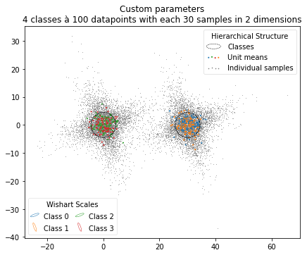
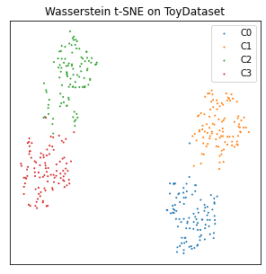

# WassersteinTSNE

This package provides the methods described in the _Wasserstein t-SNE_ paper at [www.arXiv.org/WassersteinTSNE](https://arxiv.org). 

To reproduce the figures in the paper, please also check the repository [wassersteinTSNE-paper](https://github.com/fsvbach/wassersteinTSNE-paper), which uses a previous version of this package. 

## Installation

You can install WassersteinTSNE via 

```
pip install WassersteinTSNE
```

or clone this repository into your working directory. 

## Basic Usage

You may import the package in either of these ways

```
import WassersteinTSNE as WT
from WassesteinTSNE import TSNE
```


### Data 

The data should be provided in either of two ways:

1. As a `pd.DataFrame` where the index indicates which sample belongs to which units
2. As a `np.ndarray` where each line corresponds to a sample **and** a list of unit ids

If you don't have a dataset at hand you can generate a toy dataset by running

```
dataset, HGM = WT.ToyDataset()
```

or create a random HGMM

```
HGM = WT.HierarchicalGaussianMixture(seed=67)
dataset = HGM.generate_data()
```

By default that creates a HGMM with K=4 classes. This corresponds to a `pd.DataFrame` with N=100 units and M=30 samples each. If each sample has F=2 (as in this example) features, you can visualize the generated HGMM by 

```
WT.plotMixture(HGM)
```



### Gaussian Wasserstein t-SNE

The straight forward way to embed your hierarchical dataset is 

```
embedding = WT.TSNE(dataset, seed=67, w=0.5)
```

or do the procedure step by step with

```
Gaussians = WT.Dataset2Gaussians(dataset)
GWD       = WT.GaussianWassersteinDistance(Gaussians)
embedding = WT.ComputeTSNE(GWD.matrix(w=0.5), seed=67)
```


All embeddings are returned as a `pd.DataFrame`, which can be visualized with

```
WT.embedScatter(embedding, title='DemoEmbedding')
```

If you have defined classes, you can pass a dictionary that maps the unit ids to their class

```
WT.embedScatter(embedding, labeldict=HGM.labeldict())
```

to color the units according to their class. 




By adjusting the hyperparameter `w` you can put emphasis on the means or covariance matrices of the units. With  

```
D = GWD.matrix(w=0.7)
```

you can obtain the distance matrix for any value of `w`. To visualize a range of matrices you may call 

```
WT.plotMatrices([GWD.matrix(w=w) for w in WT.naming.keys()], WT.naming.values())
```


## Exact Wasserstein Distances

It is possible to compute the exact Wasserstein distances of a dataset as well. Depending on the number of units this can take some time. However, for the dataset in `WT.ToyDataset()` the computation of the pairwise distance matrix should take less than 8min on a desktop computer by running

```
D = WT.WassersteinDistanceMatrix(dataset)
```

This yields the NxN distance matrix as a `pd.DataFrame` which can then be embedded with

```
embedding = WT.ComputeTSNE(D)
```

A shortcut for this procedure is provided with

```
embedding = WT.TSNE(dataset, method='exact')
```


## Evaluation

We implemented two methods to evaluate the distance matrix of a hierarchical dataset. For both of them it is necessary to have the ground truth available as a `dict()` or as a list of labels.

```
labels = HGM.labeldict()
```

### kNN Accuracy

The kNN accuracy computes the kNN graph of the t-SNE embedding and labels each point by the majority vote of its k nearest neighbors. Using the true labels, the accuracy is then computed with

```
WT.knnAccuracy(embedding, labels)
```


### Leiden clustering

A t-SNE independent method is provided by the Leiden algorithm, that runs directly on the distance matrix. 

```
WT.LeidenClusters(D, labels)
```


## Acknowledgements

...
